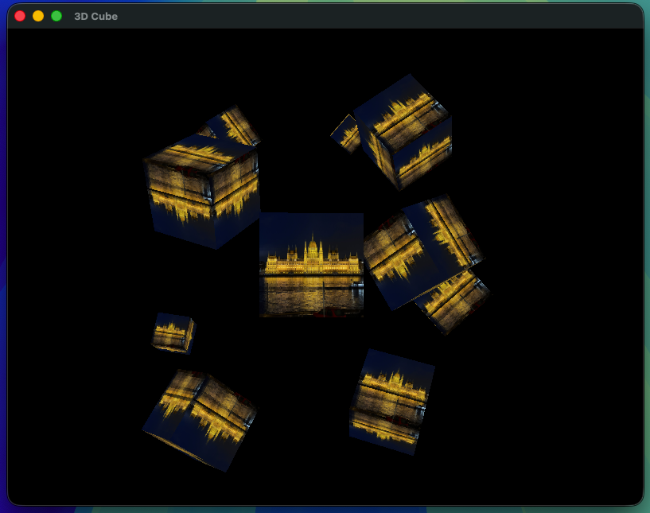

# OpenGL 3D Cube Demo (macOS ARM64)

A modern C++ OpenGL application, This project demonstrates a 3D rendering engine featuring a free-roaming camera, texture mapping, and coordinate systems. It renders multiple rotating textured cubes.



**The codebase of this project currently only works on macOS with ARM SoCs.**

## Features

* **FPS-Style Camera:** A full implementation of a camera system allowing movement (WASD) and looking around (Mouse).
* **Zoom:** Mouse scroll wheel integration to adjust the Field of View (FOV).
* **Instanced-like Rendering:** Renders 10 unique cubes in 3D space with individual rotation logic relative to time.
* **Image Loading / Texture Mapping:** Utilizes `stb_image` to wrap high-resolution textures.
* **Math:** utilizes **GLM** for matrix transformations (Model, View, Projection matrices).

## Tech Stack

* **[OpenGL](https://www.opengl.org/):** Core graphics rendering.
* **[GLFW](https://www.glfw.org/):** Window creation, context management, and input handling.
* **[GLEW](http://glew.sourceforge.net/):** OpenGL Extension Wrangler for modern OpenGL function pointers.
* **[GLM](https://github.com/g-truc/glm):** Mathematics library for vector and matrix operations.
* **[stb_image](https://github.com/nothings/stb):** Lightweight image loading.

## Installation & Build
### Prerequisites
The project is self-contained. All necessary dependencies are included in the `dep/` and `vendor/` directories, so no manual library installation is required.

* **Xcode Command Line Tools** (for the C++ compiler):
    ```bash
    xcode-select --install
    ```
* **CMake** (Usually bundled with CLion, or installable via Homebrew).
### Build Steps

1.  **Clone the repository:**
    ```bash
    git clone https://github.com/realdaveeeed/OpenGL_3DCube.git
    ```

2.  **Open in CLion:**
    * Select **File -> Open** and choose the project folder.
    * CLion will detect `CMakeLists.txt`

3.  **Run:**
    * Select the configuration and click the **Run** button.
